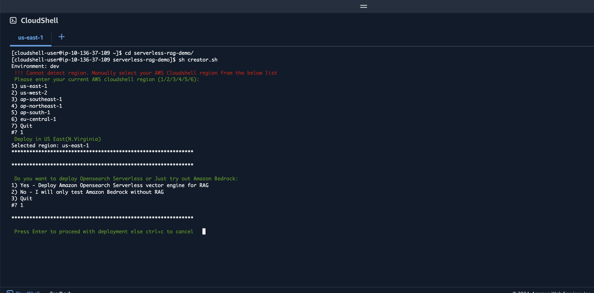
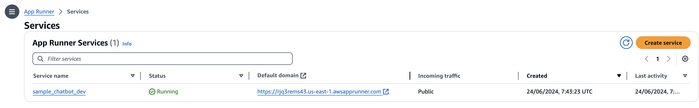
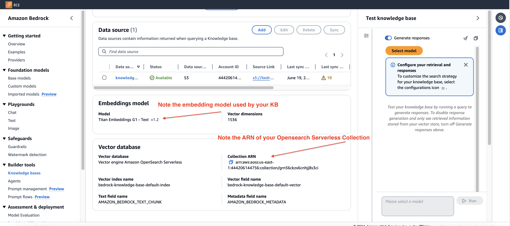
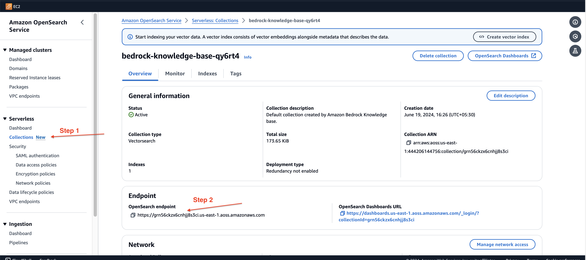
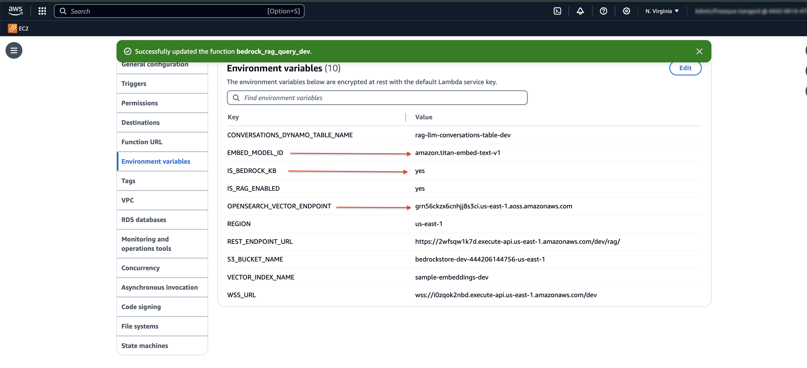
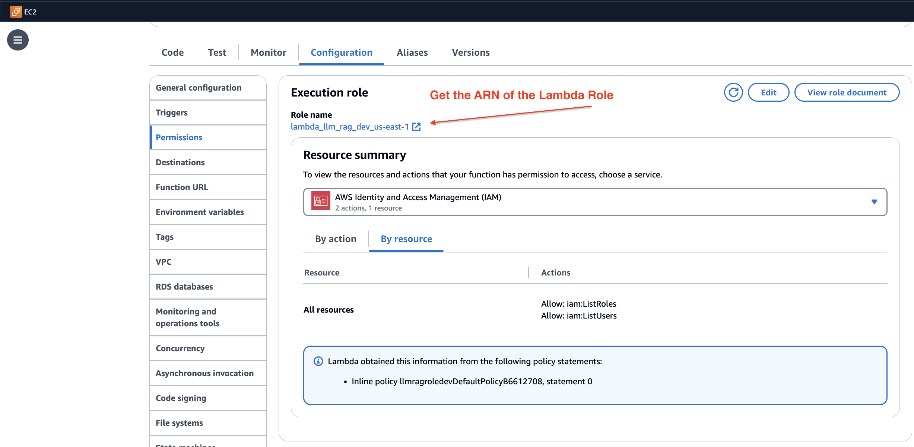
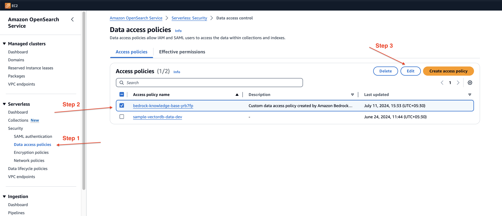
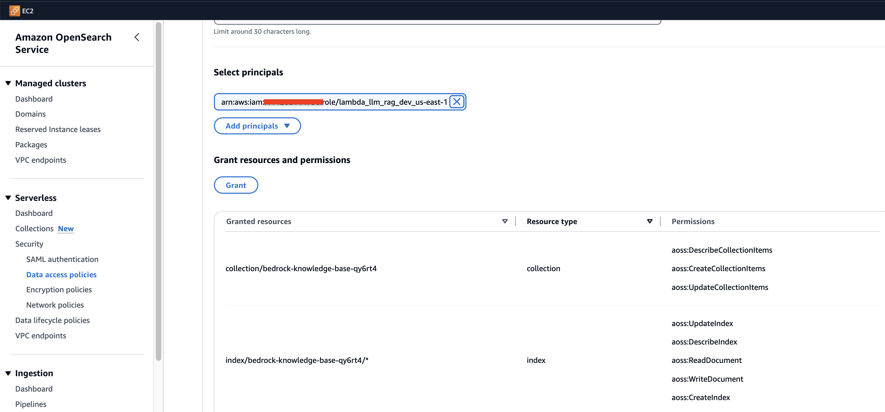

### Scalable RAG solutions/Agentic Workflows with Amazon Bedrock and Amazon Opensearch serverless service


# Overview

Widespread AI adoption is being driven by generative AI models that can generate human-like content. However, these foundation models are trained on general data making it less effective for domain specific tasks. There lies the importance of Retrieval Augmented Generation (RAG). RAG allows augmenting prompts with relevant external data for better domain-specific outputs. With RAG, documents and queries are converted to embeddings, compared to find relevant context, and that context is appended to the original prompt before being passed to the LLM. Knowledge libraries can be updated asynchronously to provide the most relevant external data for augmenting prompts.

[Amazon Opensearch Serverless(AOSS) offers vector engine to store embeddings for faster similarity searches](https://aws.amazon.com/blogs/big-data/introducing-the-vector-engine-for-amazon-opensearch-serverless-now-in-preview/). The vector engine provides a simple, scalable, and high-performing similarity search capability in Amazon OpenSearch Serverless that makes it easy for you to build generative artificial intelligence (AI) applications without having to manage the underlying vector database infrastructure. 

> [!NOTE]
> This repository offers a production ready easily deployable Generative AI solution with the below features:
>   1. <b>Document chat </b>
>   2. <b>Multi-Agent collaboration </b>
>   3. <b>Sentiment Analysis </b>
>   4. <b>PII Redaction </b>
>   5. <b>OCR </b>

> [!IMPORTANT]
> The Older UI is maintained in the v0.0.1(Old-UI) branch.

### Prerequisites
  <details open>
     <summary><b> Prerequisites </b></summary>
    
  * [An AWS account](https://aws.amazon.com/console/)
  * [For Amazon Bedrock, you should have access to Anthropic Claude models](https://docs.aws.amazon.com/bedrock/latest/userguide/model-access.html)
  * [Amazon Bedrock supported regions](https://docs.aws.amazon.com/bedrock/latest/userguide/what-is-bedrock.html#bedrock-regions)
  * [Amazon Opensearch serverless(AOSS) supported regions](https://aws.amazon.com/about-aws/whats-new/2023/01/amazon-opensearch-serverless-available/)
  #### Familiarity with below Services 
  * [AWS IAM](https://docs.aws.amazon.com/iam/index.html). 
  * [AWS Lambda](https://docs.aws.amazon.com/lambda/latest/dg/welcome.html)
  * [Amazon API Gateway](https://docs.aws.amazon.com/apigateway/latest/developerguide/welcome.html)
  * [Amazon opensearch serverless](https://docs.aws.amazon.com/opensearch-service/latest/developerguide/serverless-overview.html)

  </details>


### Architecture


### Deploying the Solution to your AWS account with AWS Cloudshell

<details>
 <summary><b> Create an Admin User to deploy this stack </b></summary>

 #### Section1 - Create an IAM user with Administrator permissions (OPTIONAL:  If you're already an Admin role, you may skip this step) 

1. Search for the service IAM on the AWS Console and go the IAM Dashboard and click on “Roles“ tab under ”Access Management” and Click on “Create Role”


2. Select AWS Account and click “Next“


3. Under permissions select Administrator access


4. Give the role a name and create the role
   

5. You can now assume this role and proceed to deploy the stack. Click on Switch-Role


6. Switch role


7. Proceed to cloudshell step
</details>


<details>
 <summary><b> Deploy the RAG based Solution (Total deployment time 40 minutes) </b></summary>

#### Section 2 - Deploy this RAG based Solution (The below commands should be executed in the region of deployment)

1. Switch to Admin role. Search for Cloudshell service on the AWS Console and follow the steps below to clone the github repository
   


2. Git Clone the serverless-rag-demo repository from aws-samples
   ```
    git clone https://github.com/aws-samples/serverless-rag-demo.git
   ```

3. Go to the directory where we have the downloaded files.
   ```
     cd serverless-rag-demo
   ```

4. Fire the bash script that creates the RAG based solution. Pass the environment and region for deployment. environment can be dev,qa,sandbox. Look at Prerequisites to deploy to the correct region.
   ```
     sh creator.sh
   ```

5. Press **Enter** to proceed with deployment of the stack or **ctrl+c** to exit

   

6. The UI is hosted on AppRunner the link to AppRunner could be found in CloudShell once the script execution is complete, or you could also go to the AppRunner service on the AWS Console and obtain the https url. The UI is authenticated through Amazon Cognito hence the very first time you would have to sign-up and then sign-in to login to the application
 

</details>


<details>
  
   <summary><b>(ADVANCED) Using an existing Bedrock Knowledge base</b></summary>

   > [!IMPORTANT]
   > You could query your existing Knowledge base created on Amazon Bedrock provided it uses Amazon Opensearch Serverless service. 

#### Steps
1. Get the Collection ARN and the embedding model used by your Knowledge base on Bedrock

2. Head to Amazon Opensearch Serverless and search by ARN to fetch Opensearch Endpoint

3. Modify the configurations of your `bedrock_rag_query_*` lambda function. Set the below
   a. IS_BEDROCK_KB = yes  
   b. OPENSEARCH_VECTOR_ENDPOINT = <<Amazon Opensearch Serverless endpoint of your Bedrock KB >>
   c. EMBED_MODEL_ID = <<Embedding Model ID used by your Bedrock KB>>
   
4. Get the ARN of the Lambda role
   
5. Head to Amazon Opensearch on the AWS Console and click on Data Access Policies. Search for the Data Access Policy attached to your Bedrock KB and click on the `Edit` button
   
6. In the principal section add the ARN of your Lambda role and hit save
   
7. Now try Document Chat on the UI, it should query from your Amazon Bedrock Knowledge base.

   > [!IMPORTANT]
   > We do not support indexing to an existing Knowledge base. That can be done through the Amazon Bedrock Console.
</details>
