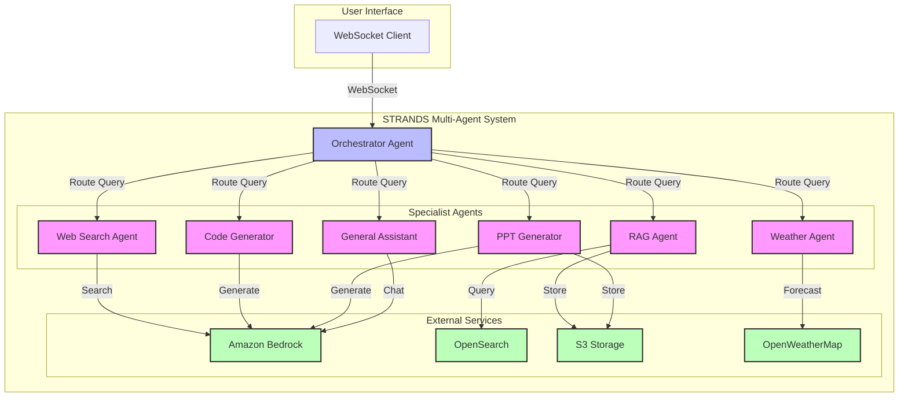

# STRANDS Multi-Agent System

A powerful multi-agent orchestration system built on top of Amazon Bedrock, enabling specialized agents to work together to handle complex user queries.

## Overview

The STRANDS Multi-Agent system is designed to coordinate multiple specialized AI agents to provide comprehensive assistance across various domains. The system uses an Orchestrator to analyze user queries and route them to the most appropriate specialized agent.

## System Architecture



## Installation

```bash
pip install strands-agents strands-agents-tools
```

## Available Agents

The system includes the following specialized agents:

1. **Web Search Agent**
   - Handles queries requiring real-time web information
   - Performs web searches to find up-to-date information
   - Uses DuckDuckGo for web searches

2. **Retriever Agent**
   - Manages RAG (Retrieval-Augmented Generation) queries
   - Retrieves specific information from the knowledge base
   - Uses vector search for semantic matching
   - Supports OpenSearch integration

3. **Code Generator Agent**
   - Specializes in programming and code generation tasks
   - Can generate code snippets and solutions
   - Supports multiple programming languages
   - Uses Claude for code generation

4. **Weather Agent**
   - Provides weather information for specific locations
   - Handles weather-related queries and forecasts
   - Uses OpenWeatherMap API

5. **PPT Generator Agent**
   - Creates PowerPoint presentations
   - Supports various presentation themes
   - Generates structured content for slides
   - Uses python-pptx for presentation generation

6. **General Assistant Agent**
   - Handles general queries outside specialized domains
   - Provides conversational assistance
   - Coordinates with other agents when needed
   - Uses Claude for natural conversation

## Architecture

The system is built using:
- Amazon Bedrock for LLM capabilities
- WebSocket for real-time communication
- Vector database (OpenSearch) for RAG functionality
- Modular agent architecture for easy extension
- STRANDS framework for agent orchestration

## Directory Structure

```
strands_multi_agent/
├── orchestrator.py           # Main orchestrator for agent coordination
├── web_search_agent.py      # Web search functionality
├── retriever_agent.py       # RAG and knowledge base queries
├── code_generator_agent.py  # Code generation capabilities
├── weather_agent.py         # Weather information handling
├── ppt_generator_agent.py   # Presentation generation
├── casual_conversations_agent.py  # General conversation handling
└── ppt_themes/             # Presentation themes and templates
```

## Usage

The system is designed to be used through a WebSocket interface. Messages should be sent in the following format:

```json
{
  "query": "user query string",
  "behaviour": "advanced-agent",
  "query_vectordb": "yes",
  "model_id": "anthropic.claude-3-haiku-20240307-v1:0"
}
```

## License

This project is licensed under the MIT License - see the LICENSE file for details.

## References

- [STRANDS Agents Documentation](https://strandsagents.com/0.1.x/)
- [STRANDS Multi-Agent Example](https://github.com/strands-agents/docs/blob/main/docs/examples/python/multi_agent_example/index.md)
- [Amazon Bedrock Documentation](https://docs.aws.amazon.com/bedrock/) 