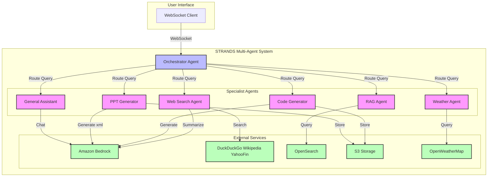

# Multi-Agent Orchestration Made Simple

STRANDS[https://strandsagents.com/] is a powerful multi-agent orchestration opensource sdk. We've used the "Agents as Tools" architectural pattern wherein our Specialised agents are wrapped in as callable functions that can be used by other Agents. The Primary Orchestrator handles user interaction and calles relevant specialist agents. It then reflects if the user question is successfully answered 


## System Architecture



The architecture leverages the ["Agents as Tools"](https://strandsagents.com/0.1.x/user-guide/concepts/multi-agent/agents-as-tools/)  pattern, with a centralized Orchestrator Agent that routes queries to six specialized agents: 
* [Web Search Agent](https://github.com/aws-samples/serverless-rag-demo/blob/strands/artifacts/bedrock_lambda/query_lambda/strands_multi_agent/web_search_agent.py)
* [Code Generator](https://github.com/aws-samples/serverless-rag-demo/blob/strands/artifacts/bedrock_lambda/query_lambda/strands_multi_agent/code_generator_agent.py) 
* [General Assistant](https://github.com/aws-samples/serverless-rag-demo/blob/strands/artifacts/bedrock_lambda/query_lambda/strands_multi_agent/casual_conversations_agent.py) 
* [PPT Generator](https://github.com/aws-samples/serverless-rag-demo/blob/strands/artifacts/bedrock_lambda/query_lambda/strands_multi_agent/ppt_generator_agent.py)
* [RAG Agent](https://github.com/aws-samples/serverless-rag-demo/blob/strands/artifacts/bedrock_lambda/query_lambda/strands_multi_agent/retriever_agent.py)
* [Weather Agent](https://github.com/aws-samples/serverless-rag-demo/blob/strands/artifacts/bedrock_lambda/query_lambda/strands_multi_agent/weather_agent.py) 

Each specialist agent communicates with services like Amazon Bedrock, OpenSearch, S3 Storage, and OpenWeatherMap and calls multiple other agents to fulfill their specific functions.


## Installation

```bash
pip install strands-agents strands-agents-tools
```

* You can also run these agents individually in standalone mode
