# Multi-Agent Orchestration Made Simple

STRANDS[https://strandsagents.com/] is a powerful multi-agent orchestration opensource sdk. We've used the "Agents as Tools" architectural pattern wherein our Specialised agents are wrapped in as callable functions that can be used by other Agents. The Primary Orchestrator handles user interaction and calles relevant specialist agents. It then reflects if the user question is successfully answered 


## System Architecture

```mermaid
graph TB
    subgraph "User Interface"
        UI[WebSocket Client]
    end

    subgraph "STRANDS Multi-Agent System"
        Orchestrator[Orchestrator Agent]
        
        subgraph "Specialist Agents"
            WebSearch[Web Search Agent]
            Retriever[RAG Agent]
            CodeGen[Code Generator]
            Weather[Weather Agent]
            PPTGen[PPT Generator]
            General[General Assistant]
        end

        subgraph "Agent Tools"
            subgraph "Web Search Tools"
                DuckDuckGo[DuckDuckGo Search]
                WebScraper[Web Scraper]
            end

            subgraph "RAG Tools"
                VectorSearch[Vector Search]
                DocLoader[Document Loader]
                TextSplitter[Text Splitter]
            end

            subgraph "Code Tools"
                CodeFormatter[Code Formatter]
                SyntaxChecker[Syntax Checker]
                LangDetector[Language Detector]
            end

            subgraph "Weather Tools"
                WeatherAPI[OpenWeatherMap API]
                LocationParser[Location Parser]
                ForecastFormatter[Forecast Formatter]
            end

            subgraph "PPT Tools"
                ThemeManager[Theme Manager]
                SlideGenerator[Slide Generator]
                ContentFormatter[Content Formatter]
            end

            subgraph "General Tools"
                ChatFormatter[Chat Formatter]
                ContextManager[Context Manager]
                ResponseFormatter[Response Formatter]
            end
        end

        subgraph "External Services"
            Bedrock[Amazon Bedrock]
            OpenSearch[OpenSearch]
            S3[S3 Storage]
            WeatherAPI[OpenWeatherMap]
        end
    end

    UI -->|WebSocket| Orchestrator
    Orchestrator -->|Route Query| WebSearch
    Orchestrator -->|Route Query| Retriever
    Orchestrator -->|Route Query| CodeGen
    Orchestrator -->|Route Query| Weather
    Orchestrator -->|Route Query| PPTGen
    Orchestrator -->|Route Query| General

    WebSearch -->|Use| DuckDuckGo
    WebSearch -->|Use| WebScraper
    Retriever -->|Use| VectorSearch
    Retriever -->|Use| DocLoader
    Retriever -->|Use| TextSplitter
    CodeGen -->|Use| CodeFormatter
    CodeGen -->|Use| SyntaxChecker
    CodeGen -->|Use| LangDetector
    Weather -->|Use| WeatherAPI
    Weather -->|Use| LocationParser
    Weather -->|Use| ForecastFormatter
    PPTGen -->|Use| ThemeManager
    PPTGen -->|Use| SlideGenerator
    PPTGen -->|Use| ContentFormatter
    General -->|Use| ChatFormatter
    General -->|Use| ContextManager
    General -->|Use| ResponseFormatter

    WebSearch -->|Search| Bedrock
    Retriever -->|Query| OpenSearch
    Retriever -->|Store| S3
    CodeGen -->|Generate| Bedrock
    Weather -->|Forecast| WeatherAPI
    PPTGen -->|Generate| Bedrock
    PPTGen -->|Store| S3
    General -->|Chat| Bedrock

    classDef agent fill:#f9f,stroke:#333,stroke-width:2px
    classDef tool fill:#ffd,stroke:#333,stroke-width:2px
    classDef service fill:#bbf,stroke:#333,stroke-width:2px
    classDef external fill:#bfb,stroke:#333,stroke-width:2px
    
    class WebSearch,Retriever,CodeGen,Weather,PPTGen,General agent
    class DuckDuckGo,WebScraper,VectorSearch,DocLoader,TextSplitter,CodeFormatter,SyntaxChecker,LangDetector,WeatherAPI,LocationParser,ForecastFormatter,ThemeManager,SlideGenerator,ContentFormatter,ChatFormatter,ContextManager,ResponseFormatter tool
    class Orchestrator service
    class Bedrock,OpenSearch,S3,WeatherAPI external
```



## Installation

```bash
pip install strands-agents strands-agents-tools
```

* You can also run these agents individually in standalone mode